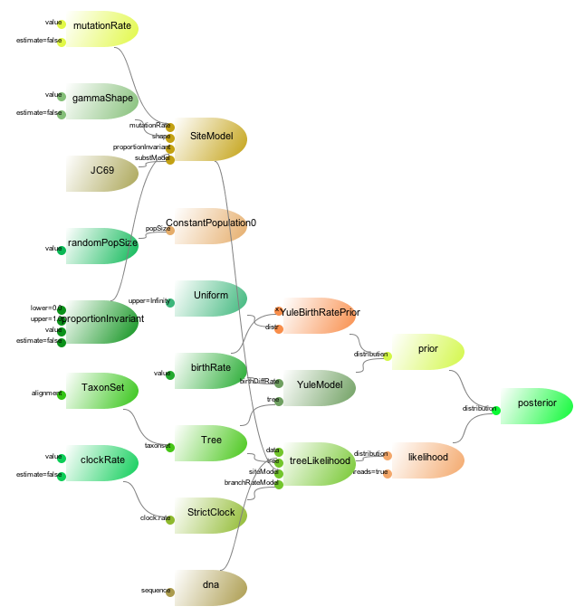

#Beasy: setting up BEAST XML without tears

<center>
Remco Bouckaert 

[remco@cs.auckland.ac.nz](mailto:remco@cs.auckland.ac.nz)
</center>

# Introduction

Beasy is a small scripting language for building BEAST XML files. This difference between Beasy and [other scripts](http://www.beast2.org/2018/03/09/10-ways-to-generate-beast-xml.html) is that Beasy relies on BEAUti templates. Many BEAST packages come with BEAUti templates, which allow these packages to be used from within BEAUti. With Beasy, these templates can be used as well. This means that when new packages become available, they will be immediately available, where other scripts requires updates. So, Beasy will **always be up to date** with the latest packages.

Beasy is **compact**. For example to specify a standard analysis with HKY substitution model with a relaxed clock and coalescent with exponential growth, the following will be sufficient:

```
template Standard;
import ../beast2/examples/nexus/dna.nex;
use substModel{dna} = HKY;
use branchRateModel{dna} = RelaxedClockLogNormal;
use [prior] = CoalescentExponentialPopulation;
```
This is the canonical form, where every input-identifier is explicitly formulated. When there is no ambiguity, for instance, because there is only a single place in the model where a substitution model or clock model would fit, the input-identifier can be omitted, giving the abbreviated form below:

```
mode compact;
template Standard;
import ../beast2/examples/nexus/dna.nex;
use HKY;
use RelaxedClockLogNormal;
use [prior] = CoalescentExponentialPopulation;

```

Note that the input identifier for the prior cannot be omitted, since there are multiple CompoundDistributions where the coalescent distribution would fit (namely, in the posterior and in the likelihood).
 
Beasy allows you to do pretty much **everything you can do in BEAUti**, like selecting sub-templates, setting values, adding priors, etc. But, you can run it from the command line, and it is easier to apply to multiple alignments.


# Using Beasy

To use Beasy, first you need to install the Beasy package in the [package manager](http://www.beast2.org/managing-packages/). 

There are two ways to use Beasy: as a script interpreter (converting a Beasy script from file to XML), or interactively using the Read-Eval-Print-Loop (REPL). Both can be started  using the AppLauncher either from a terminal.

For instances, to convert the file `BeasyScript.bea` containing a Beasy script to `beast.xml`, use

```
applauncher BeasyInterpreter -in BeasyScript.bea -out beast.xml
```

To start the REPL, just run from a terminal `applauncher BeasyREPL` or choose `Beasy REPL` from the application launcher dialog that you get when choosing the menu `File/Launch Apps` in BEAUti.

# Beasy philosophy

Beasy uses BEAUti as its engine to edit models, and shares the same philosophy: a model consists of a set of BEAST objects. BEAST objects have inputs connecting them with other BEAST objects and with primitive values (double, int, boolean, etc). Together, the BEAST objects form a directed acyclic graph.



Editing the model means

* simply changing the primitive values, for instance, changing the starting value of the clock rate from the default of 1 to 1e-6.
* replacing a sub graph with another sub graph of BEAST objects, and connecting some of these BEAST objects with the correct loggers, operators, priors, and state.

The second action is encoded in BEAUti sub-templates, so most of the complexity is hidden.


# Beasy syntax

Beasy consists of commands separated by semicolons. The first command should say which `template` is being used (e.g. Standard or StarBeast2), equivalent to selecting a template under the `File/templates` menu in BEAUti. Usually, this is followed by the `import` command for getting data in NEXUS format into the model (equivalent with the `File/Import` menu in BEAUti).
This is followed by a number of other commands. The order only matters in the sense they matter in BEAUti (like linking site models, setting the site model, followed by unlinking the site models).

## Beasy commands

Commands are `template`, `import`, `link`, `ulink`, `use`, `set`, `taxonset`, `add`, `rename`, `rm`.


## Input identifiers

To identify the input(s) that need to be updated, we use `inputidentifiers`. Inputs can be identified by id, by name, by name of the element in the XML followed by the input name, and these can be conditioned on partitions that they are in. To give a few examples

```java
// all inputs with name branchRateModel:
branchRateModel 

// branchRateModel inputs for partition coding1 and coding2, but no other partitions:
branchRateModel{coding1, coding2} 

// branchRateModel for object with id="treeLikelihood1":
branchRateModel[treeLikelihood1] 

// all branchRateModel inputs for distribution elements:
distribution@branchRateModel 
```


## Comments

You can insert comments using C/Java style comments, like so:

```java
template StarBeast2; // this comment goes to the end of the the line

/** 
 * this comment starts at the backslash and continues
 * over multiple lines to the next backslash
 **/
import ../beast2/examples/nexus/28.nex;
```

# Common actions

## Selecting the main templates

## Importing data and creating partitions

## Removing partitions

## Linking/Unlinking partitions

## Changing substitution models

## Changing clock models

## Changing tree models

## Changing default values/templates

## Specifying calibrations


