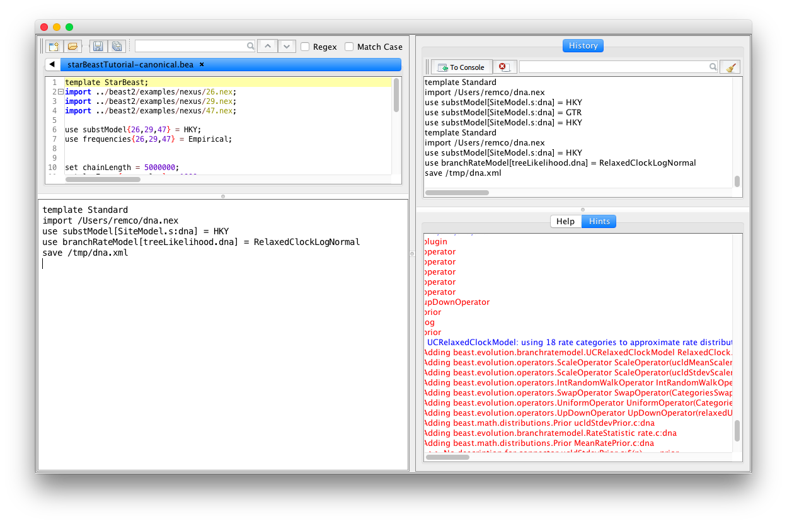

# Beasy: setting up BEAST XML without tears

<center>
Remco Bouckaert 

[r.bouckaert@auckland.ac.nz](mailto:r.bouckaert@auckland.ac.nz)
</center>

# Introduction

Beasy is a small scripting language for building BEAST XML files. This difference between Beasy and [other scripts](http://www.beast2.org/2018/03/09/10-ways-to-generate-beast-xml.html) is that Beasy relies on BEAUti templates. Many BEAST packages come with BEAUti templates, which allow these packages to be used from within BEAUti. With Beasy, these templates can be used as well. This means that when new packages become available, they will be immediately available, where other scripts requires updates. So, Beasy will **always be up to date** with the latest packages.

Beasy is **compact**. For example to specify a standard analysis with HKY substitution model with a relaxed clock and coalescent with exponential growth, the following will be sufficient:

```
template Standard;
import ../beast2/examples/nexus/dna.nex;
use substModel{dna} = HKY;
use branchRateModel{dna} = RelaxedClockLogNormal;
use [prior] = CoalescentExponentialPopulation;
```
This is the canonical form, where every input-identifier is explicitly formulated. When there is no ambiguity, for instance, because there is only a single place in the model where a substitution model or clock model would fit, the input-identifier can be omitted, giving the abbreviated form below:

```
mode compact;
template Standard;
import ../beast2/examples/nexus/dna.nex;
use HKY;
use RelaxedClockLogNormal;
use [prior] = CoalescentExponentialPopulation;

```

Note that the input identifier for the prior cannot be omitted, since there are multiple CompoundDistributions where the coalescent distribution would fit (namely, in the posterior and in the likelihood).
 
Beasy allows you to do pretty much **everything you can do in BEAUti**, like selecting sub-templates, setting values, adding priors, etc. But, you can run it from the command line, and it is easier to apply to multiple alignments.


# Using Beasy

To use Beasy, first you need to install the Beasy package in the [package manager](http://www.beast2.org/managing-packages/). 

There are three ways to use Beasy: as a script interpreter (converting a Beasy script from file to XML), interactively using the Read-Eval-Print-Loop (REPL) or interactively using Beasy Studio. All these can be started using the AppLauncher either from a terminal, or via Beauti using the `File/Launch Apps` menu.

For instances, to convert the file `BeasyScript.bea` containing a Beasy script to `beast.xml`, use

```
applauncher BeasyInterpreter -in BeasyScript.bea -out beast.xml
```

To start the REPL, just run from a terminal `applauncher BeasyREPL` or choose `Beasy REPL` from the application launcher dialog that you get when choosing the menu `File/Launch Apps` in BEAUti.


Beasy Studio is a small integrated development environment where you can easily develop Beasy scripts, and which supports code completion to some extent, online help, a history and Beasy script editor.




# Beasy philosophy

Beasy uses BEAUti as its engine to edit models, and shares the same philosophy: a model consists of a set of BEAST objects. BEAST objects have inputs connecting them with other BEAST objects and with primitive values (double, int, boolean, etc). Together, the BEAST objects form a directed acyclic graph.


Editing the model means

* simply changing the primitive values, for instance, changing the starting value of the clock rate from the default of 1 to 1e-6.
* replacing a sub graph with another sub graph of BEAST objects, and connecting some of these BEAST objects with the correct loggers, operators, priors, and state.

The second action is encoded in BEAUti sub-templates, so most of the complexity is hidden.


# Beasy syntax

Beasy consists of commands separated by semicolons. The first command should say which `template` is being used (e.g. Standard or StarBeast2), equivalent to selecting a template under the `File/templates` menu in BEAUti. Usually, this is followed by the `import` command for getting data in NEXUS format into the model (equivalent with the `File/Import` menu in BEAUti).
This is followed by a number of other commands. The order only matters in the sense they matter in BEAUti (like linking site models, setting the site model, followed by unlinking the site models).

## Beasy commands

Commands are `template`, `import`, `link`, `ulink`, `use`, `set`, `taxonset`, `add`, `rename`, `rm`.


## Input identifiers

To identify the input(s) that need to be updated, we use `inputidentifiers`. Inputs can be identified by id, by name, by name of the element in the XML followed by the input name, and these can be conditioned on partitions that they are in. To give a few examples

```java
// all inputs with name branchRateModel:
branchRateModel 

// branchRateModel inputs for partition coding1 and coding2, but no other partitions:
branchRateModel{coding1, coding2} 

// branchRateModel for object with id="treeLikelihood1":
branchRateModel[treeLikelihood1] 

// all branchRateModel inputs for distribution elements:
distribution@branchRateModel 
```


## Comments

You can insert comments using C/Java style comments, like so:

```java
template StarBeast2; // this comment goes to the end of the the line

/** 
 * this comment starts at the backslash and continues
 * over multiple lines to the next backslash
 **/
import ../beast2/examples/nexus/28.nex;
```

# Common actions

## Selecting the main templates

The first thing to specify is a template using `template <template name>`, e.g.,

```
template StarBeast2;
```

To find out which template names are available in BeasyStudio, type `template ` followed by the `tab` key and a list will be displayed in the "Hints" window. These are the same template names as shown in BEAuti under the `File/Templates` menu. Using

```
?template 
```
will show the templates in the `Help` window in `BeasyStudio`.


## Importing data and creating partitions

Importing single or multiple  sequence alignments from a nexus or fasta file can be done using the `import` command, for example `import ../beast2/examples/nexus/primatesmtDNA.nex` would import the `primates-mtDNA.nex` file from the BEAST 2 examples directory. Filenames are auto-completed in BeasyStudio using the `tab` key.

```
import alignmentprovider? filename ( '(' arg (',' arg)* ')' )? 
```

## Removing partitions

To remove a partition use the `rm <inputidentifier>` command. It takes as argument an `<inputidentifier>` that identifies an alignment, and removes the partitions associated with this identifier. For example, to remove the `coding` partition, which is created when importing the `primates-mtDNA.nex` file, use

```
rm {coding};
```

## Linking/Unlinking partitions

Partitions can have their `tree`, `clock` and/or `sitemodel` shared by linking them using the `link` command. The format of the link command is `link <partition> {partition1, partition2, ...}` where `<partition>` is either `tree`, `clock` or `sitemodel` and `partition1`, `partition2`, etc. the names of the partitions. For example, link site models for partitions `1stpos`, `2ndpos` and `3rdpos` use

```
link sitemodel {1stpos,2ndpos,3rdpos};
```

After linking, the three partitions share the same clock model and it will have the label of `1stpos`. To unlink partitions, use the `unlink` command which has the same format as the `link` command but with `link` replaced by `unlink`. So, to unlink the site models linked above use

```
unlink sitemodel {1stpos};
```

## Linking/Unlinking parameters

Parameters, like the gamma shape parameter for sitemodel with gamma rate heterogeneity, can be shared among partitions, using the same `link` command, but with `param` as first argument and input-identifier as second, e.g., 

```
link param shape
```

This links the parameter that is in the shape input of the site model -- be aware that this also matches all other inputs with name `shape`, so you may be a bit more specific and specify this as

```
link param shape[SiteModel]
```

Likewise, if you have a parameter that is shared among a number of inputs, these can be unlinked using the `unlink` command, like so:

```
unlink param shape[SiteModel]
```

## Changing substitution models

The `use` command allows changing models by invoking available sub-templates, and is usually used in the format `use <input identifier> = <sub template>`, where `<input identier>` identifies inputs as outlined in the [Input Identifier] section, and `<sub template>` one of the available sub-templates. For example, to set the substitution model of the `1stpos` partition to HKY, use

```
use substModel{1stpos} = HKY;
```

In the compact notation, `use HKY` (that is, with input identifier omitted) will try to apply the HKY template to any available input. Since it only matches with `substModel` inputs for nucleotide partitions, it will set all these substitution models to HKY.

To set site models of a selected set of partitions, for example, for partitions `1stpos`, `2ndpos` and `3rdpos` use

```
use substModel{1stpos,2ndpos,3rdpos} = HKY;
```

Alternatively, you can link the `sitemodel`s of the partitions, set the model, then unlink them.

## Changing clock models

By default, a strict clock model is assumed in most templates. To change it to a relaxed clock with log normal distributed rates, use

```
use branchRateModel{1stpos} = RelaxedClockLogNormal;
```

Rates tend to differ in different partitions. To estimate rates across partitions such that the mean rate is the fixed (`fix mean rate` in BEAUti) make sure the mutation rate for the site models are estimated. If that is not desirable, you can keep mutation rates fixed at their starting value (default 1) using

```
set estimate[mutationRate] = false;
```

Warning: you should not estimate both relative rates and clock rates, since these are not identifiable (see [how to set up rates](http://www.beast2.org/2015/06/23/help-beast-acts-weird-or-how-to-set-up-rates.html) for more on this).


## Changing tree priors

Since tree priors are input to the `prior` distribution, changing the tree prior means changing input with `id=prior`, for example, like so

```
use [prior] = CoalescentConstantPopulation;
```

## Changing default values/templates


To set values of primitive inputs, the `set` command, which has the format `set <input identifier> = <value>` where `<input identifier>` identifies inputs as outlined in the [Input Identifier] section, and `<value>` a value that is admitted for the input. For instance, by default, the kappa paramater for the HKY model is set to 2. To set it to 1 for partition `1stpos`, use

```
set kappa{1stpos} = 1
```

Alternatively, when setting up the substitution model, you can pass it as an extra parameter to the template, like so:

```
use substModel{1stpos} = HKY(kappa=1.0)
```


## Specifying calibrations and other priors

Tip dates and tip calibrations are easiest set in the NEXUS file by adding `sets` and `assumptions` blocks and use the `import` command to include them in the analysis. This is an example NEXUS file fragment: 

```
# Define monophyletic clades
begin sets;
taxset germanic = oldnorse oldhighgerman oldprussian oldenglish;
taxset tocharian = tocharian_a tocharian_b;
taxset anatolian = hittite lycian luvian;
end;

# Define time calibrations on tips, and clades.
# Note that since anatolian does not have a calibration, 
# only a monophyletic MRCAPrior is created in BEAUti
begin assumptions;
calibrate oldnorse = normal(775,40)
calibrate avestan = normal(2500,50)
calibrate gothic = normal(1650,25)
calibrate germanic = normal(1875,67)
calibrate tocharian = offsetlognormal(1650,200,0.9)
end;
```


An alternative is to specify a internal a taxon set first, then add an MRCAPrior for the taxon set, for example

```
taxonset Hominidae = Homo_sapiens Pan Pongo Gorilla;
add MRCAPrior(Hominidae, Normal(mean=20,sigma=3.5), treepartition);
```

The arguments for MRCAPrior are

* `Hominidae` the name of the taxon set.
* `Normal(mean=20,sigma=3.5)` a parametric distribution. Any sub-template for distributions can be used. By default, there are `Uniform`, `Exponential`, `LogNormal`, `Normal`, `Beta`, `Gamma`, `LaplaceDistribution`, `InverseGamma`, `OneOnX`, but other packages may have more distributions.
* `treepartition` optional argument with the name of the tree partition that the prior should apply to.


By default MRCAPriors does not enforce monophyly of the clade. To enforce monophyly, use

```
set monophyletic[Hominidae.prior] = true
```

Note that the MRCAPrior for the set `Hominidae` will be called `Hominidae.prior`.
To set a tip prior, after setting a node prior (potentially only containing the tip node), you can set `tipsonly` to true.

```
set tipsonly[Hominidae.prior] = true
```


# Syntax

The Beasy syntax is defined by a antlr grammar that can be found [here](https://github.com/rbouckaert/beasy/blob/master/src/beast/app/beauti/compactanalysis/CA.g4).